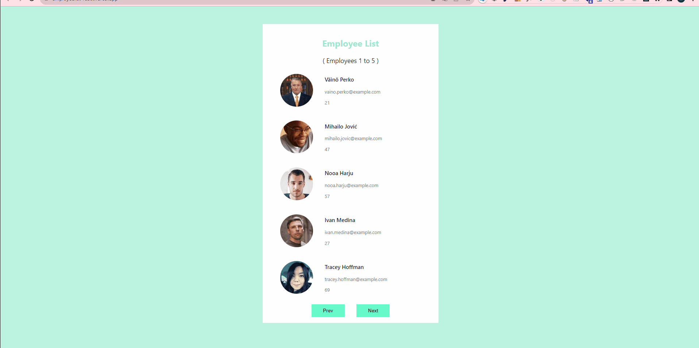

## Description
Creating a page using react js, react hooks and react event

##  Live Link
[Live](https://employeelist-react.vercel.app/)

## How does my project look

## Technologies
* React 
* React Events
* Hooks(UseState)

In the project directory, you can run:
### `npm install`   &  `npm start`
OR
### `yarn install`   &  `yarn start`

